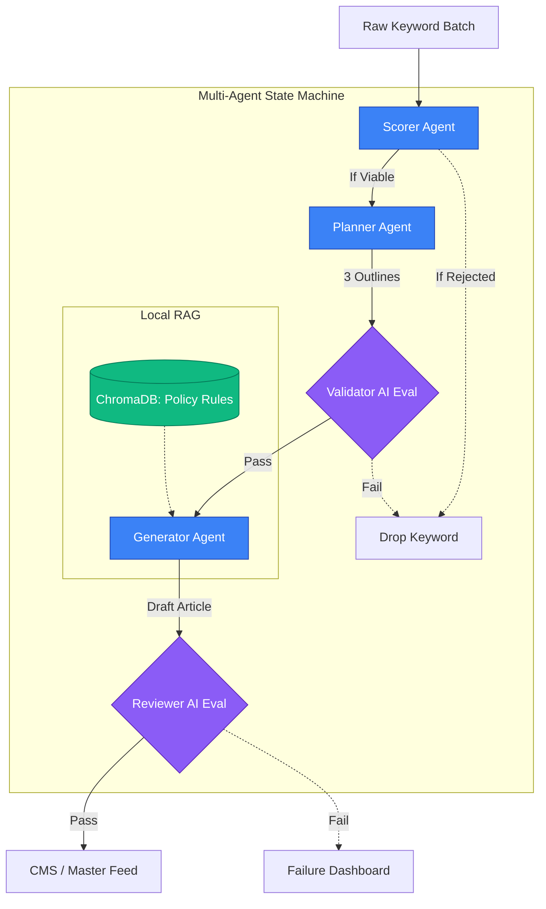

# ContentForge: Multi-Agent Content Pipeline

ContentForge is an autonomous, multi-agent AI pipeline designed to scale high-quality SEO content generation while strictly enforcing enterprise compliance and monetization constraints (such as Google Ads policies).

Built entirely with a **LangGraph state machine** and powered by **Google Gemini** models, ContentForge moves beyond single-purpose AI wrappers to showcase true, deterministic agentic orchestration. 


## System Architecture

The core of ContentForge is a 5-node LangGraph state machine. Each node represents a distinct AI agent with a specific role. 

Below is the deterministic flowchart of the pipeline. Notice how the **Decision Gates** (Validator and Reviewer) act as automated AI Evals (LLM-as-a-Judge) to route or reject content:



1. 🎯 **Scorer Agent:** Evaluates raw keywords for commercial viability and search intent. Rejects low-value keywords immediately to save compute.
2. 🗺️ **Planner Agent:** Generates 3 distinct, high-quality SEO content outlines (angles) for approved keywords.
3. ⚖️ **Validator Agent:** Acts as an internal filter, reviewing the generated outlines to ensure they are logical, non-spammy, and structurally sound.
4. ✍️ **Generator Agent (with RAG):** Queries a local ChromaDB vector database containing strict policy documents to ground its generation. It drafts full-length articles tailored to the validated outlines.
5. 🛡️ **Reviewer Agent:** The final compliance check. Grades the output against policy rules. Articles that fail are flagged with exact reasoning and blocked from the final export feed.

## Technology Stack

### Backend
* **Orchestration:** LangGraph (StateGraph, Conditional Edges)
* **LLMs:** Google Gemini (2.5 Pro for reasoning/validation, 2.5 Flash for high-speed generation)
* **API:** FastAPI (with Server-Sent Events for real-time streaming)
* **RAG / Vector DB:** ChromaDB + LangChain Google GenAI Embeddings

### Frontend
* **Framework:** React + Vite
* **Styling:** Tailwind CSS v4 + Framer Motion
* **Features:** Real-time state visualizer, autonomous batch processing, and a high-level execution dashboard.

---

## Local Setup & Installation

### Prerequisites
* Python 3.9+
* Node.js (v18+)
* Google Gemini API Key

### 1. Backend Setup
Navigate to the backend directory, create a virtual environment, install dependencies, and start the FastAPI server:

```bash
cd backend
python -m venv venv
source venv/bin/activate
pip install -r requirements.txt

# Start the SSE streaming API
uvicorn main:app --reload --port 8000
```

### 2. Frontend Setup
Navigate to the frontend directory, install dependencies, and start the Vite dev server:

```bash
cd frontend
npm install

# Start the React UI
npm run dev
```

### 3. Usage
1. Open your browser to `http://localhost:5173`.
2. Enter your Gemini API key in the top navigation bar.
3. Click **"Generate Demo Batch"** to simulate a keyword feed.
4. Click **"Run Entire Batch Automatically"** and watch the LangGraph state machine route the data through the agents in real-time.

## Production Roadmap

While this repository serves as a pilot, scaling to thousands of articles requires moving from prototype to enterprise-grade infrastructure:
* **Vector Database:** Swap local ChromaDB for managed **Pinecone** or **Weaviate**.
* **Observability:** Integrate **LangSmith** or **Arize Phoenix** to monitor token usage and trace agent hallucinations.
* **Resilience:** Wrap the LangGraph execution layer in **Temporal.io** or AWS SQS to handle async queueing and rate-limiting gracefully.

---
*Built with ❤️ alongside AntiGravity (Google DeepMind).*
